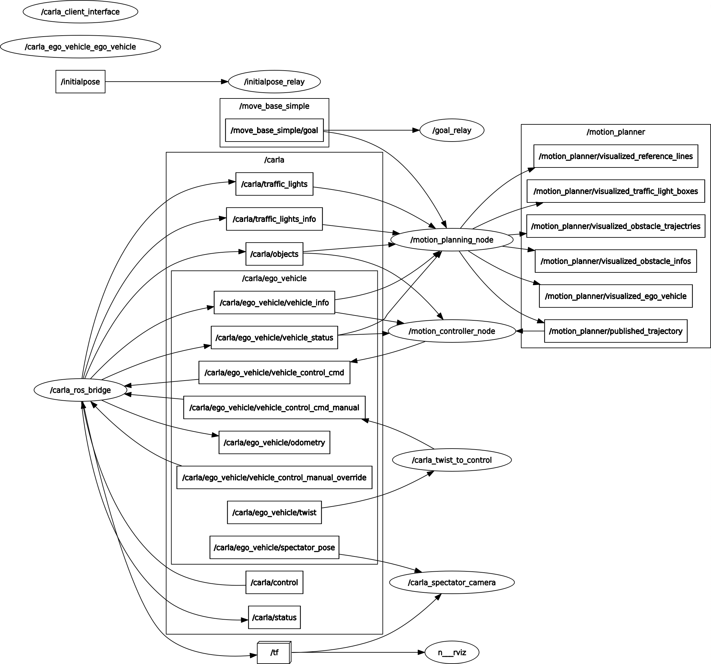

# Motion Planning With Carla Simulator

[TOC]

# 1.依赖

- Ubuntu18.04
- ROS Melodic
- carla-simulator 0.9.9
- carla-ros-bridge

# 2. Ros Graph

# 3. 参考线

## 3.1 样条曲线

[样条曲线](https://github.com/ttk592/spline)： 用于生成参考线。

## 3.2 参考线平滑

Object Function: 
$$
J = w_{1} \sum_{i = 1}^{N-1} ((x[i] - x[i - 1]) ^2 + (y[i] - y[i-1])^2) + \\
w_2 \sum_{i=0}^{N-1} ((x[i] - x_{\text{ref}}[i])^2 + (y[i] - y_{\text{ref}}[i])^2) + \\w_3 \sum_{i = 1}^{N-2}((x[i+1] + x[i-1]-2x[i])^2 + (y[i+1]+y[i-1]-2y[i])^2)
$$
Constraints:
$$
x_{\text{ref}}[i] - b[i] \leq x[i] \leq x_{\text{ref}}[i] + b[i], i = 0,\ldots, N-1. \\
y_{\text{ref}}[i] - b[i] \leq y[i] \leq y_{\text{ref}}[i] + b[i], i = 0,\ldots, N-1. \\
((x[i+1] + x[i-1]-2x[i])^2 + (y[i+1]+y[i-1]-2y[i])^2) \leq (k_{\max} \Delta s^2)^2 
$$

其中，$b[i] , i = 0, \ldots,N-1$ 为waypoint 的上下界。$x_{\text{ref}}[i], y_{\text{ref}}[i]$ 为原始waypoint的坐标值。约束项第三项为曲率约束。 

求解器： IPOPT

## 3.3 样条曲线上最近点

[Robust and Efficient Computation of Closest Point on a Spline](https://www.semanticscholar.org/paper/Robust-and-Efficient-Computation-of-the-Closest-on-Wang-Kearney/50334aefe4a1de7277bd96822db707f55726ab3a). 

# 4. 规划器

## 4.1 Frenet Lattice Planner

done

## 4.2 PVD Planner

todo

# 5. 控制器

## 5.1 Pid_PurePursuit

纵向控制： PID 

横向控制： Pure Pursuit

## 5.2 Pid_Stanley

纵向控制： PID

横向控制： Stanley

## 5.3 MPC

todo

# 6. Result

